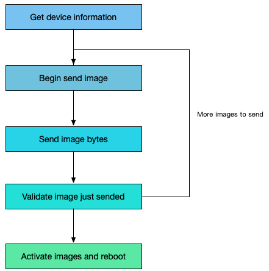
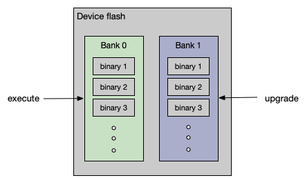

#  Understanding Realtek DFU procedure

Understand Realtek DFU related terms and how upgrade works.

## Upgrade flow

When you use RTKOTASDK to upgrade binaries on a device. SDK communicates with remote device and send binary bytes to remote device. Normally, one upgrade contains sending multiple images. During each image sending, sdk sending image bytes and request device to validate this image when finish send all bytes. When one image is successfully send and validated, sdk continues sending the next images. When all images is send, sdk requests device to activate those new images and reboot to use new images.

## Dual bank scheme

Some devices use dual bank scheme to store executable and data binaries. When a device boot, it will use images on only one bank of the two, typically the one containing newer images. The bank containing images currently executing is called active bank, and the other bank is called free bank. When upgrading, the new images will be stored at free bank, without affecting normal functionality. If upgrade successfully, device reboot to use the new images and changes the previous free bank to active.

## Communication Profile

RTKOTASDK supports upgrading device which is connected by GATT profile or iAP profile. You use a CBPeripheral object to identify a device which is connected by GATT profile via BLE or BREDR. You provides a EAAccessory object to identify a device which is connected by iAP profile.

## Normal mode and OTA mode

Some Realtek implemented peripheral could boot to a specific running mode (termed as OTA mode) which is dedicated to upgrade. On the contrary, a device runs in Normal mode to provide its functionality service. You can request a Normal mode running device to reboot to OTA mode for upgrading if this device supports OTA mode. Upgrading could also be supported by a Normal mode running device, which means you could upgrade it without reboot it.

## RWS pair upgrade

Multiple devices could be engaged to form a device group, such as RWS earbuds pair. When be upgraded, all devices in a group should be updated. RTKOTASDK supports upgrading a pair of RWS earbuds. During upgrading, sdk will upgrade each device in sequence. When all device get upgraded, the overall upgrade task is completed.
