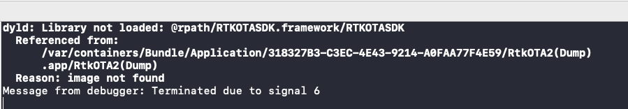
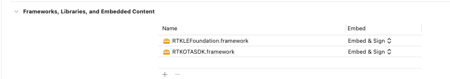

#  FAQ

Frequently encountered questions when use RTKOTASDK.

## App is terminated and "dyld: Library not loaded:" is printed in Console.

This is due to framework is not embeded in app bundle. You should edit your target and make this framework embeded.

## DFUConnection activate fail and report `RTKOTAErrorRequiredAttributeNotExist` or `RTKErrorIAPProtocolNotSupport`

When communicate upon GATT, the device to upgrade is required to implement DFU GATT Service. When communicate upon iAP, the device is required to implement BBpro iAP protocol.

## Is RTKOTASDK thread-safe ?

  Yes.

## Is possible to upgrade multiple device at the same time ?

  Yes. You could create multiple ``RTKDFUUpgrade`` instance and start upgrade several device concurrently. The number of simultaneous upgrade may be limited by platform.
