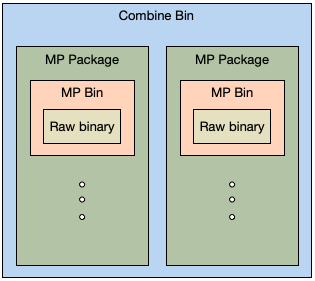

#  Understanding what file can be used for upgrading

What file RTKOTASDK recognizes and able to extract separate images for upgrading.

## File format

### MPBin

A file that containing one specific images. Calling ``+[RTKOTAUpgradeBin imagesExtractedFromMPPackFilePath:error:]`` with this format faile will return one ``RTKUpgradeBin`` object.

### MPPackBin

A package containing multiple images for one device. Calling ``+[RTKOTAUpgradeBin imagesExtractedFromMPPackFilePath:error:]`` with this format faile will return multiple ``RTKUpgradeBin`` objects. If the file is for a dual bank device, it will contain images for both bank, e.g., two DSP config images one is for Bank 0 and the other for Bank 1.

### CombineBin

A package containing multiple images for both devices of a RWS pair. Calling ``+[RTKOTAUpgradeBin extractCombinePackFileWithFilePath:toPrimaryBudBins:secondaryBudBins:]`` with this format faile will return two array each containing multiple ``RTKUpgradeBin`` objects.
